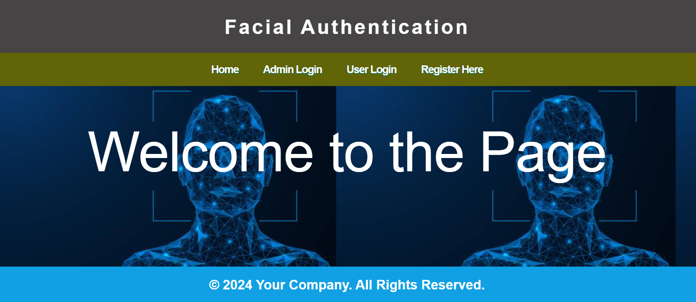

# Facial Authentication Using Django

This project implements a facial authentication system using Django, OpenCV, and MySQL. Users can register with their facial images, which are stored and used for login authentication.

## Features

- User registration with facial recognition.
- Secure document upload with encryption.
- Admin dashboard for managing users and documents.
- User profile and document viewing functionalities.

## Prerequisites

- Python 3.x
- Django
- OpenCV
- MySQL 
- `cryptography` package
- `PIL` (Pillow) package

## Installation

### Clone the Repository

```bash
git clone https://github.com/pankaj7322/Facial-Authentication-django.git
cd Facial-Authentication-django
python -m venv env (optional)
env\Scripts\activate (optional)
pip install -r requirements.txt
python manage.py runserver
```
(password should be change on view.py and settings.py file)


